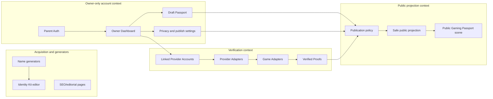
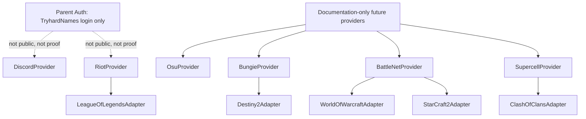
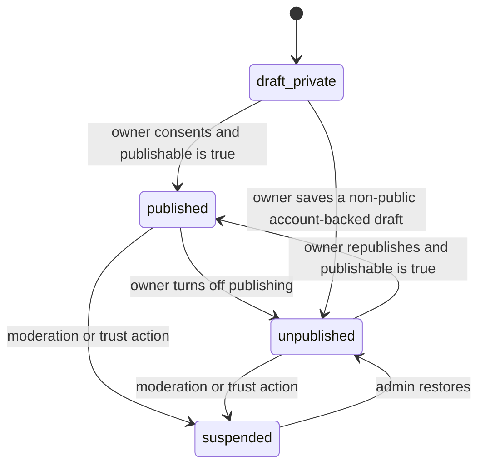

# Gaming Passport Architecture

Gaming Passport is the single identity product for TryhardNames: a visual, verifiable, shareable, and extensible gamer resume.

It is not a tracker, an OP.GG alternative, a parallel ranking, a custom MMR/ELO system, or a platform for comparing who is better.

## Product Boundaries

Current generators, tools, navigation, and public pages continue to work without an account. Gaming Passport adds an optional identity layer around ownership, verified proofs, publishing, and cosmetics. It does not replace the existing generators.

Identity Kit becomes the editor and builder for a Gaming Passport. Public Identity Card, Competitive Identity, and Verified Identity become subsystems inside the same product, not separate products.

## Bounded Contexts

## Parent Auth

Parent Auth is only for entering TryhardNames.

Future MVP:

- email/password;
- Google.

Possible future parent auth providers:

- Apple;
- Facebook;
- X.

Parent Auth never appears in Gaming Passport, never becomes a badge, never becomes a proof, never counts as an achievement, and never appears publicly.

## Linked Providers

Linked Providers are external accounts connected after sign-in.

Future MVP:

- Discord;
- Riot.

Discord is a verified social identity. It is not a competitive achievement.

Riot is a gaming identity provider. It proves ownership of a Riot account. It is not, by itself, a competitive rank or achievement.

## Provider And Game Adapter Hierarchy

League of Legends is not modeled as an independent provider. It is a game adapter under Riot.

ProviderAdapter responsibilities:

- linking;
- ownership verification;
- callback handling;
- tokens;
- refresh;
- unlink;
- revoke;
- connection state.

GameAdapter responsibilities:

- query game data;
- normalize proofs;
- synchronize proofs;
- version normalizers.

Clash of Clans, if ever implemented, would use `playerTag` and an API Token generated inside the game for one-time verification. That token must never be stored.

Future providers listed above are documentation-only. This PR must not add implementation code, placeholders, route stubs, integration configs, or contracts specific to future providers.

Explicitly out of scope for contracts, code, placeholders, and active roadmap:

- Epic/Fortnite;
- Roblox;
- Free Fire;
- Rockstar/GTA;
- Halo;
- Call of Duty;
- Apex Legends;
- Overwatch official;
- PUBG;
- Dota 2;
- Clash Royale;
- Brawl Stars;
- Steam;
- FACEIT;
- Path of Exile;
- Wargaming.

## Passport States

There is exactly one Gaming Passport per owner.

Persisted Passport states:

- `draft_private`;
- `published`;
- `unpublished`;
- `suspended`.

`publishable` is not a persisted state. It is derived from policy:

- a Parent Auth account is authenticated;
- at least one `LinkedProviderAccount` is verified;
- publication consent exists;
- a valid slug exists;
- the Passport is not `suspended`.

`stale` and `revoked` belong to linked provider accounts and proofs, not to the whole Passport.

## Draft Private Rules

An account without linked providers can:

- create a draft;
- edit it;
- preview it;
- equip a local theme;
- understand how the public Passport could look.

It cannot:

- activate a public URL;
- appear in search;
- present itself as verified;
- share an active public profile.

## Publication Cycle

## Proof Taxonomy

A linked account is not automatically an achievement.

Verified proof types:

1. `social_verification`
   - Example: Discord verified.
2. `provider_ownership`
   - Example: Riot account verified.
3. `competitive_rank`
   - Example: League of Legends Emerald IV Solo/Duo.
4. `competitive_rating`
   - Example future: OsuProvider PP/global rank.
5. `progression_achievement`
   - Example future: Destiny title, WoW Mythic+, Clash career peak.
6. `title_or_completion`
   - Officially verifiable titles or completions.

Manual declared data does not belong in `VerifiedProof`. Do not create a `self_declared` proof inside the verified collection.

## Verified Proof Contract

Minimum fields:

- `id`;
- `linkedProviderAccountId`;
- `provider`;
- `game`;
- `proofType`;
- `sourceKey`;
- `mode`;
- `title`;
- `displayValue`;
- `normalizedValue` optional;
- `season` optional;
- `source`;
- `verificationMethod`;
- `status`;
- `verifiedAt`;
- `lastSyncedAt`;
- `staleAt`;
- `revokedAt`;
- `visibility`;
- `metadataSafe`;
- `normalizerVersion`.

Do not store full third-party payloads as public metadata. `metadataSafe` is an allowlisted, bounded object for display-safe primitives only.

## Linked Provider And Proof States

`LinkedProviderAccount` states:

- `pending`;
- `verified`;
- `failed`;
- `stale`;
- `revoked`.

`VerifiedProof` states:

- `current`;
- `stale`;
- `revoked`.

All state changes must use explicit transitions. Free string states are invalid.

## Public Profile Rules

The public Gaming Passport shows one visual scene.

Rules:

- all selected identity and proof data appear together, not as separate game pages;
- recommended maximum is 4 to 6 featured proofs;
- show only data that exists;
- do not render empty slots;
- do not render "Connect account" cards;
- do not render placeholders;
- do not render match history;
- do not render tracker-style tables;
- do not show Parent Auth providers;
- do not show private information.

Recommendations to connect more accounts belong only in the Owner Dashboard.

## Cosmetics

Cosmetics belong to TryhardNames:

- borders;
- auras;
- themes;
- animations;
- visual gadgets;
- future 3D figures.

Cosmetics do not monetize ranks, third-party data, or third-party assets.

Do not create a global Tryhard Score in this foundation. Future cosmetic unlock logic may consider depth in one game, multi-game diversity, proof count, and verified ownership as separate dimensions. Rules such as 3/5/10 are future configuration, not fixed domain constants.

## Supabase Boundary

This PR does not touch Supabase.

It must not:

- create projects;
- create tables;
- execute migrations;
- install `@supabase/supabase-js`;
- use service role credentials;
- add keys;
- modify Vercel env;
- connect to a remote project.

The documents prepare a future migration PR where SQL can be reviewed separately.
