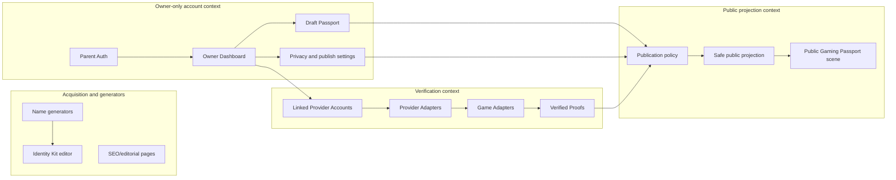
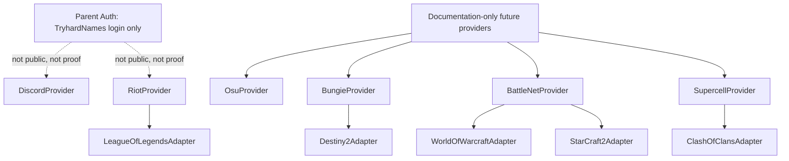
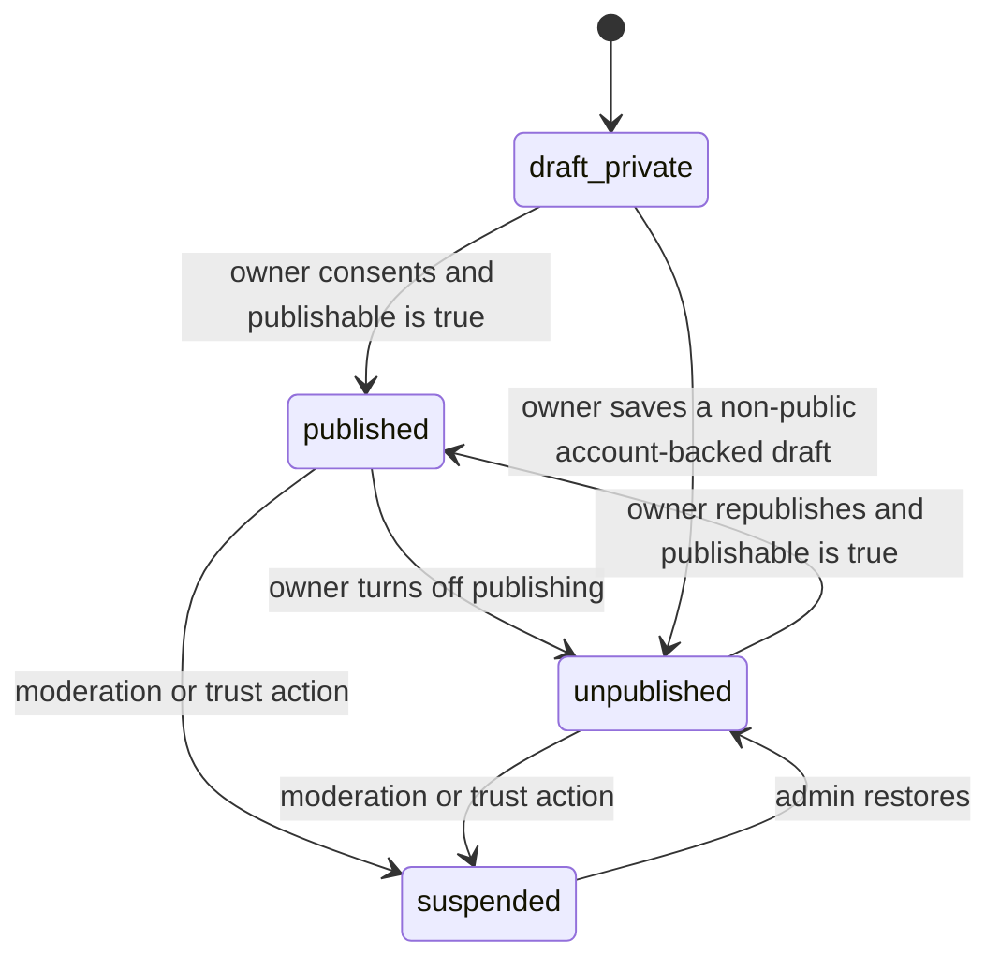

# Gaming Passport Architecture

Gaming Passport is the single identity product for TryhardNames: a visual, verifiable, shareable, and extensible gamer resume.

It is not a tracker, an OP.GG alternative, a parallel ranking, a custom MMR/ELO system, or a platform for comparing who is better.

## Current Implementation Note

This document began as a target architecture contract. Since then, PR4 implemented Parent Auth and the protected `/account` private draft surface, PR6 implemented the public `/gaming-passport` landing page, PR3 added a local-only schema foundation, PR14 implemented publish runtime commands, PR15 implemented the public `/id/:slug` MVP with allowlisted projection data, and PR16 added provider-neutral runtime foundation scaffolding. Provider activation, proof sync, Riot OAuth, Discord OAuth, and Riot API calls remain future/not implemented.

Google is Parent Auth only. Riot and Discord remain future linked provider accounts. League of Legends remains a GameAdapter inside RiotProvider, not a standalone provider.

## PR16 Provider Runtime Foundation

PR16 adds provider-neutral runtime foundation without activating any provider.

Implemented:

- provider runtime domain contracts;
- connection intent and callback state scaffolding;
- replay and expiry guard contracts;
- token vault placeholder with no real token storage usage;
- blocked sync job scaffolding;
- provider audit events;
- owner-only RLS for foundation tables;
- private `/account` foundation panel that says providers are not live.

Still not implemented:

- Discord account linking;
- Riot account linking;
- provider-specific adapters;
- OAuth redirects or callback runtime;
- provider API calls;
- VerifiedProof sync runtime;
- real encrypted provider token storage and rotation.

The public `/id/:slug` projection remains allowlisted and is not expanded by PR16.

## Product Boundaries

Current generators, tools, navigation, and public pages continue to work without an account. Gaming Passport adds an optional identity layer around ownership, verified proofs, publishing, and cosmetics. It does not replace the existing generators.

Identity Kit becomes the editor and builder for a Gaming Passport. Public Identity Card, Competitive Identity, and Verified Identity become subsystems inside the same product, not separate products.

## Bounded Contexts

## Parent Auth

Parent Auth is only for entering TryhardNames.

PR4 implements the local Parent Auth runtime with Supabase sessions for email/password, prepares Google OAuth behind an explicit feature flag, and creates owner-only private Gaming Passport drafts. This runtime remains local/config-driven and does not connect to a remote Supabase project by itself.

Future MVP:

- email/password;
- Google.

Possible future parent auth providers:

- Apple;
- Facebook;
- X.

Parent Auth never appears in Gaming Passport, never becomes a badge, never becomes a proof, never counts as an achievement, and never appears publicly.

## Linked Providers

Linked Providers are external accounts connected after sign-in.

Future MVP:

- Discord;
- Riot.

Discord is a verified social identity. It is not a competitive achievement.

Riot is a gaming identity provider. It proves ownership of a Riot account. It is not, by itself, a competitive rank or achievement.

## Provider And Game Adapter Hierarchy

League of Legends is not modeled as an independent provider. It is a game adapter under Riot.

ProviderAdapter responsibilities:

- linking;
- ownership verification;
- callback handling;
- tokens;
- refresh;
- unlink;
- revoke;
- connection state.

GameAdapter responsibilities:

- query game data;
- normalize proofs;
- synchronize proofs;
- version normalizers.

Clash of Clans, if ever implemented, would use `playerTag` and an API Token generated inside the game for one-time verification. That token must never be stored.

Future providers listed above are documentation-only. This PR must not add implementation code, placeholders, route stubs, integration configs, or contracts specific to future providers.

Explicitly out of scope for contracts, code, placeholders, and active roadmap:

- Epic/Fortnite;
- Roblox;
- Free Fire;
- Rockstar/GTA;
- Halo;
- Call of Duty;
- Apex Legends;
- Overwatch official;
- PUBG;
- Dota 2;
- Clash Royale;
- Brawl Stars;
- Steam;
- FACEIT;
- Path of Exile;
- Wargaming.

## Passport States

There is exactly one Gaming Passport per owner.

Persisted Passport states:

- `draft_private`;
- `published`;
- `unpublished`;
- `suspended`.

`publishable` is not a persisted state. It is derived from policy:

- a Parent Auth account is authenticated;
- at least one `LinkedProviderAccount` is verified;
- publication consent exists;
- a canonical valid slug exists;
- the Passport is not `suspended`.

`stale` and `revoked` belong to linked provider accounts and proofs, not to the whole Passport.

## Owner Publish Policy And Public Serving Policy

Two pure policies are intentionally separate.

Owner publication command policy answers whether the signed-in owner may publish or republish. It requires:

- authenticated Parent Auth;
- at least one verified linked provider;
- persisted publication consent;
- canonical valid slug;
- Passport not suspended.

Anonymous public serving policy answers whether `/id/:slug` may return an already-published Passport to a visitor. It never receives Parent Auth and never depends on visitor authentication. It requires:

- Passport exists;
- `status === published`;
- canonical valid slug;
- persisted publication consent;
- Passport not suspended;
- at least one linked provider is still verified.

Provider display visibility is separate from the ownership gate. PR2 does not decide the final product question of whether a verified but hidden provider should be sufficient for publication; the current domain keeps the ownership gate internal and only applies provider visibility to the public `linkedProviders` DTO.

## Draft Private Rules

An account without linked providers can:

- create a draft;
- edit it;
- preview it;
- equip a local theme;
- understand how the public Passport could look.

It cannot:

- activate a public URL;
- appear in search;
- present itself as verified;
- share an active public profile.

## Publication Cycle

## Proof Taxonomy

A linked account is not automatically an achievement.

Verified proof types:

1. `social_verification`
   - Example: Discord verified.
2. `provider_ownership`
   - Example: Riot account verified.
3. `competitive_rank`
   - Example: League of Legends Emerald IV Solo/Duo.
4. `competitive_rating`
   - Example future: OsuProvider PP/global rank.
5. `progression_achievement`
   - Example future: Destiny title, WoW Mythic+, Clash career peak.
6. `title_or_completion`
   - Officially verifiable titles or completions.

Manual declared data does not belong in `VerifiedProof`. Do not create a `self_declared` proof inside the verified collection.

## Verified Proof Contract

Minimum fields:

- `id`;
- `linkedProviderAccountId`;
- `provider`;
- `game`;
- `proofType`;
- `sourceKey`;
- `mode`;
- `title`;
- `displayValue`;
- `normalizedValue` optional;
- `season` optional;
- `source`;
- `verificationMethod`;
- `status`;
- `verifiedAt`;
- `lastSyncedAt`;
- `staleAt`;
- `revokedAt`;
- `visibility`;
- `metadataSafe`;
- `normalizerVersion`.

Do not store full third-party payloads as public metadata. `metadataSafe` is an internal optional field by default and is not projected publicly in PR2. Each future GameAdapter may define an explicit public attribute schema, but a generic metadata regex must not decide what becomes public.

Proof structural invariants:

- `social_verification`: `game === null`, `source === linked_provider`.
- `provider_ownership`: `game === null`, `source === linked_provider`.
- `competitive_rank`: `game` required, `source === game_adapter`.
- `competitive_rating`: `game` required, `source === game_adapter`.
- `progression_achievement`: `game` required, `source === game_adapter`.
- `title_or_completion`: `game` required, `source === game_adapter`.

The proof provider must match the source linked provider account.

## Linked Provider And Proof States

`LinkedProviderAccount` states:

- `pending`;
- `verified`;
- `failed`;
- `stale`;
- `revoked`.

`VerifiedProof` states:

- `current`;
- `stale`;
- `revoked`.

All state changes must use explicit transitions. Free string states are invalid.

## Public Profile Rules

The public Gaming Passport shows one visual scene.

Rules:

- all selected identity and proof data appear together, not as separate game pages;
- recommended maximum is 4 to 6 featured proofs;
- show only data that exists;
- do not render empty slots;
- do not render "Connect account" cards;
- do not render placeholders;
- do not render match history;
- do not render tracker-style tables;
- do not show Parent Auth providers;
- do not show private information.

Recommendations to connect more accounts belong only in the Owner Dashboard.

## Public DTO Contract

The public projection is minimal and allowlisted.

Passport DTO keys:

- `slug`;
- `alias`;
- `avatarUrl`;
- `publishedAt`;
- `updatedAt`;
- `scene`;
- `linkedProviders`;
- `featuredProofs`.

Linked provider DTO keys:

- `provider`;
- `displayName`;
- `verifiedAt`;
- `lastSyncedAt`.

Proof DTO keys:

- `provider`;
- `game`;
- `proofType`;
- `mode`;
- `title`;
- `displayValue`;
- `season`;
- `status`;
- `verifiedAt`;
- `lastSyncedAt`;
- `staleAt`.

The public DTO must not expose Passport ids, linked provider ids, proof ids, owner ids, external account ids, `sourceKey`, `normalizedValue`, `verificationMethod`, `normalizerVersion`, generic `metadataSafe`, provider tokens, emails, or raw payloads.

## Canonical Identifiers

Persisted public slugs must already be canonical. `normalizePublicSlug(raw)` is for future form input; persisted publication and public serving must require `raw === normalizePublicSlug(raw)`.

External account ids are opaque to the shared domain. `toProviderOwnershipKey` normalizes only the provider id and trims the external id. Each ProviderAdapter must produce a `canonicalExternalAccountId` using official provider rules before persistence.

## Cosmetics

Cosmetics belong to TryhardNames:

- borders;
- auras;
- themes;
- animations;
- visual gadgets;
- future 3D figures.

Cosmetics do not monetize ranks, third-party data, or third-party assets.

Do not create a global Tryhard Score in this foundation. Future cosmetic unlock logic may consider depth in one game, multi-game diversity, proof count, and verified ownership as separate dimensions. Rules such as 3/5/10 are future configuration, not fixed domain constants.

## Supabase Boundary

PR16 adds local versioned SQL for provider runtime foundation tables and RLS. It does not touch remote Supabase configuration.

It must not:

- create remote projects;
- execute remote migrations;
- use service role credentials;
- add keys;
- modify Vercel env;
- connect to a remote project;
- store live provider tokens.

The provider token vault table is a placeholder. Authenticated clients have no grants on it, and `token_ciphertext` is constrained to `null` in PR16.
