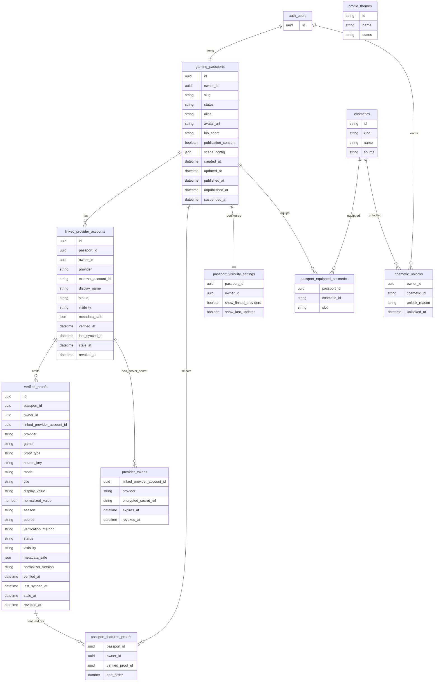

# Gaming Passport Data Model

This document defines the conceptual data model and tracks the local database foundation introduced after the domain contract. PR3 adds reviewable local Supabase migration files and database tests only. It does not connect to a remote project, create production tables, add public RPCs, store secrets, or change runtime behavior.

## PR3 Implementation Status

Implemented locally:

- `gaming_passports`;
- `linked_provider_accounts`;
- `verified_proofs`;
- `passport_featured_proofs`;
- `passport_visibility_settings`.

Aplazado:

- provider token or credential storage;
- cosmetics;
- profile themes;
- cosmetic unlocks;
- equipped cosmetics;
- sync jobs;
- audit logs;
- public RPCs or views;
- public serving endpoints.

`auth.users` is the parent auth principal for PR3. `owners` remains a logical concept in product documentation and does not imply an `owners` table. A separate profile table should only be added if a future migration has a concrete need for owner profile data that cannot live in the Passport model.

## Proposed Entities

1. `gaming_passports`
2. `linked_provider_accounts`
3. `verified_proofs`
4. `passport_featured_proofs`
5. `passport_visibility_settings`
6. `profile_themes`
7. `cosmetics`
8. `cosmetic_unlocks`
9. `passport_equipped_cosmetics`
10. `provider_credentials` or `provider_tokens`, server-side only

`owners` is a logical principal in this document, not a table. With Supabase it maps to `auth.users.id` unless a later reviewed migration proves that a separate profile table is necessary.

## Relational Model

## Constraints

Minimum rules enforced by the local PR3 migration or reserved for the next reviewed migrations:

- exactly one `gaming_passports` row per owner;
- `slug` is globally unique when present;
- `slug` must already be canonical when persisted;
- a published Passport must have a canonical slug, persisted consent, and `published_at`;
- `UNIQUE(provider, external_account_id)` is global;
- one external provider account cannot belong to two users;
- `external_account_id` is opaque to the shared domain;
- `external_account_id`, proof `source_key`, proof `mode`, and `normalizerVersion` are persisted already-trimmed;
- each ProviderAdapter must persist a `canonicalExternalAccountId` using official provider rules;
- composite foreign keys prevent crossing a Passport, owner, provider account, and proof from different ownership trees;
- browser writes to `gaming_passports` are limited to safe presentation fields;
- provider accounts and proofs are server-owned records;
- JSONB payloads have byte-size caps to prevent arbitrary large blobs;
- helper functions live outside the exposed API schema;
- provider tokens are separate from public data;
- provider tokens are never accessible through frontend reads;
- public reads use an allowlist projection;
- `profile_metadata` or equivalent full JSON blobs are not exposed publicly;
- raw third-party payloads are not exposed publicly;
- timestamps are explicit;
- states are explicit;
- proof normalizers are versioned.

## Gaming Passport

`gaming_passports` is the owner-level object. It stores presentation identity and publication state. It does not store provider tokens, raw payloads, emails, auth providers, or proof payload blobs.

Suggested fields:

- `id`;
- `owner_id`;
- `slug`;
- `status`;
- `alias`;
- `avatar_url`;
- `bio_short`;
- `publication_consent`;
- `scene_config`;
- `created_at`;
- `updated_at`;
- `published_at`;
- `unpublished_at`;
- `suspended_at`.

Allowed `status` values:

- `draft_private`;
- `published`;
- `unpublished`;
- `suspended`.

Do not persist `publishable`; calculate it.

Authenticated browser writes may create only a private draft and may update only presentation fields: `alias`, `avatar_url`, `bio_short`, and `scene_config`. Slug claiming, publication consent, publication state, suspension, and deletion are future server-side command flows.

## Linked Provider Account

`linked_provider_accounts` stores external account ownership. It is not a proof of achievement by itself.

Suggested fields:

- `id`;
- `passport_id`;
- `owner_id`;
- `provider`;
- `external_account_id`;
- `display_name`;
- `status`;
- `visibility`;
- `verified_at`;
- `last_synced_at`;
- `stale_at`;
- `revoked_at`;
- `metadata_safe`;
- `created_at`;
- `updated_at`.

Allowed `status` values:

- `pending`;
- `verified`;
- `failed`;
- `stale`;
- `revoked`.

Allowed `visibility` values:

- `private`;
- `public`.

Provider visibility controls whether the linked provider summary appears in the public DTO. Proof visibility remains independent. PR2 intentionally leaves open whether a verified but private provider is sufficient for final product publication policy; the current domain can use private providers for internal ownership validation while omitting them from `linkedProviders`.

Riot ownership may emit a `provider_ownership` proof. It does not emit a `competitive_rank` proof unless a GameAdapter synchronizes a real game rank.

Discord ownership may emit a `social_verification` proof. It does not emit competitive proofs.

Provider accounts are server-owned in PR3. The browser can select owner-visible rows through RLS but cannot create, update, revoke, stale, or delete them.

## Verified Proof

`verified_proofs` stores normalized, display-safe, verifiable facts.

Minimum contract:

- `id`;
- `linkedProviderAccountId`;
- `provider`;
- `game`;
- `proofType`;
- `sourceKey`;
- `mode`;
- `title`;
- `displayValue`;
- `normalizedValue` optional;
- `season` optional;
- `source`;
- `verificationMethod`;
- `status`;
- `verifiedAt`;
- `lastSyncedAt`;
- `staleAt`;
- `revokedAt`;
- `visibility`;
- `metadataSafe`;
- `normalizerVersion`.

Allowed `proofType` values:

- `social_verification`;
- `provider_ownership`;
- `competitive_rank`;
- `competitive_rating`;
- `progression_achievement`;
- `title_or_completion`.

Allowed `status` values:

- `current`;
- `stale`;
- `revoked`.

Manual declared data stays outside `verified_proofs`.

Structural invariants:

- `social_verification`: `game` is null and `source` is `linked_provider`.
- `provider_ownership`: `game` is null and `source` is `linked_provider`.
- `competitive_rank`: `game` is required and `source` is `game_adapter`.
- `competitive_rating`: `game` is required and `source` is `game_adapter`.
- `progression_achievement`: `game` is required and `source` is `game_adapter`.
- `title_or_completion`: `game` is required and `source` is `game_adapter`.

The proof provider must match the provider on the source linked provider account. `sourceKey` and `normalizerVersion` are required internally but are not public DTO fields.

Proofs are server-owned in PR3. The browser can select owner-visible rows through RLS but cannot create, update, revoke, stale, or delete them.

`metadataSafe` remains private by default and is capped to 4096 bytes in the local schema. That cap prevents oversized payloads; it is not a public allowlist.

## Featured Proofs

`passport_featured_proofs` stores owner ordering for public highlights.

Rules:

- the database guarantees only that the proof belongs to the same Passport and owner;
- the database reserves six structural positions, `0` through `5`;
- current/public eligibility is still enforced by the pure domain projection;
- revoked proofs never display through the public projection;
- stale proofs retain `status: "stale"` if displayed;
- future UI may recommend 4 to 6, but the hard cap remains 6.

## Visibility Settings

`passport_visibility_settings` separates owner preference from Passport state.

Suggested fields:

- `passport_id`;
- `owner_id`;
- `show_linked_providers`;
- `show_last_updated`;
- `created_at`;
- `updated_at`.

Publication consent is stored on `gaming_passports` because it is part of publication state, not a display preference.

The browser may manage visibility settings rows it owns, but publication state remains outside direct browser writes.

## Token Storage

`provider_tokens` or `provider_credentials` is server-side only.

Rules:

- no frontend read path;
- no public projection;
- no token in `metadataSafe`;
- no raw access token, refresh token, API token, client secret, bearer string, or authorization header in profile JSON;
- secrets must be encrypted or referenced through a server secret manager in a future implementation.

## JSON Payload Limits

The local PR3 schema uses byte-size checks:

- `scene_config`: 8192 bytes;
- linked provider `metadata_safe`: 4096 bytes;
- verified proof `metadata_safe`: 4096 bytes.

Future provider-specific metadata schemas must be explicit and reviewed separately.

## Internal SQL Functions

Database helpers live in a non-exposed schema and are not public RPCs:

- `private.set_updated_at`;
- `private.is_canonical_gaming_passport_slug`.

The slug table constraint is inline, so browser roles do not need helper function execution privileges.

## Projections

### Owner Projection

Owner projection is for authenticated dashboard reads.

It may include:

- draft Passport fields;
- linked provider account status;
- sync status;
- private recommendations;
- local preview settings;
- publication readiness reasons;
- owned cosmetics;
- provider connection management state.

It must not expose raw tokens to the browser.

### Public Projection

Public projection is the only source for `/id/:slug`.

It is served to anonymous visitors using persisted public state only. It does not require Parent Auth or visitor authentication once the Passport is already published.

It may include:

- slug;
- alias;
- avatar;
- public scene config;
- verified linked provider summaries;
- featured proofs that pass policy;
- equipped cosmetics;
- last update timestamp;
- share metadata.

It must exclude:

- Parent Auth provider;
- email;
- private owner id;
- Passport id;
- linked provider account id;
- proof id;
- external account id;
- `sourceKey`;
- `normalizedValue`;
- `verificationMethod`;
- `normalizerVersion`;
- generic `metadataSafe`;
- provider tokens;
- raw payloads;
- private metadata;
- full profile metadata;
- local dashboard recommendations;
- empty placeholders.

Exact public DTO keys:

- Passport: `slug`, `alias`, `avatarUrl`, `publishedAt`, `updatedAt`, `scene`, `linkedProviders`, `featuredProofs`.
- Linked provider: `provider`, `displayName`, `verifiedAt`, `lastSyncedAt`.
- Proof: `provider`, `game`, `proofType`, `mode`, `title`, `displayValue`, `season`, `status`, `verifiedAt`, `lastSyncedAt`, `staleAt`.

`metadataSafe` remains an internal optional field in PR2. Future GameAdapters may propose explicit public attribute schemas in later PRs.

### Publishability Projection

Publishability projection is a private dashboard calculation.

It returns:

- `publishable`;
- missing requirements;
- slug validation;
- verified provider count;
- publication consent state;
- suspension state.

It is not a persisted Passport state.

The owner publishability projection is distinct from anonymous public serving. Owner publishing requires authenticated Parent Auth. Public serving requires only persisted public state: published status, canonical slug, consent, not suspended, and at least one still-verified linked provider.

## PR3 Local Migration Shape

PR3 ships local SQL only:

- one migration for base tables, constraints, RLS policies, and `updated_at` triggers;
- one pgTAP test file for schema, ownership, invariants, and RLS behavior;
- one CI database job that runs Supabase locally without secrets.

Future reviewed migrations may add public RPCs, token storage, cosmetics, sync jobs, and production rollout steps. Those are deliberately outside PR3.
