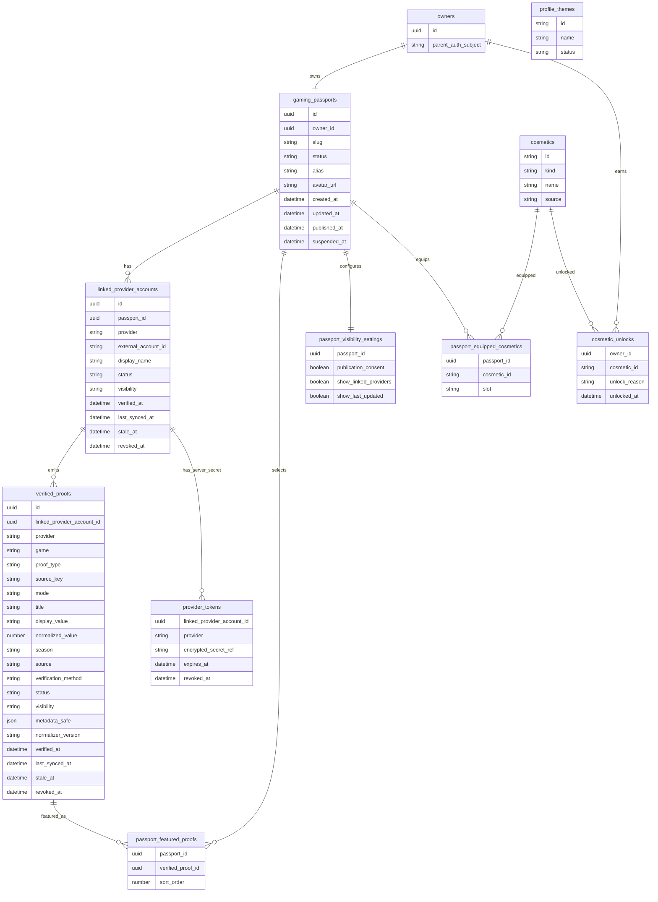

# Gaming Passport Data Model

This is a proposed model only. It does not create SQL, views, RPC functions, Supabase projects, migrations, keys, or runtime connections.

## Proposed Entities

1. `gaming_passports`
2. `linked_provider_accounts`
3. `verified_proofs`
4. `passport_featured_proofs`
5. `passport_visibility_settings`
6. `profile_themes`
7. `cosmetics`
8. `cosmetic_unlocks`
9. `passport_equipped_cosmetics`
10. `provider_credentials` or `provider_tokens`, server-side only

`owners` is a logical principal in this document, not a required table. With Supabase it can map directly to `auth.users.id`. A separate profile table should be created only if a future migration has a concrete need for profile data beyond the auth principal. PR2 does not decide that storage detail.

## Relational Model

## Constraints

Minimum rules for a future migration:

- exactly one `gaming_passports` row per owner;
- `slug` is globally unique when present;
- `UNIQUE(provider, external_account_id)` is global;
- one external provider account cannot belong to two users;
- `external_account_id` is opaque to the shared domain;
- each ProviderAdapter must persist a `canonicalExternalAccountId` using official provider rules;
- provider tokens are separate from public data;
- provider tokens are never accessible through frontend reads;
- public reads use an allowlist projection;
- `profile_metadata` or equivalent full JSON blobs are not exposed publicly;
- raw third-party payloads are not exposed publicly;
- timestamps are explicit;
- states are explicit;
- proof normalizers are versioned.

## Gaming Passport

`gaming_passports` is the owner-level object. It stores presentation identity and publication state. It does not store provider tokens, raw payloads, emails, auth providers, or proof payload blobs.

Suggested fields:

- `id`;
- `owner_id`;
- `slug`;
- `status`;
- `alias`;
- `avatar_url`;
- `bio_short`;
- `scene_config`;
- `created_at`;
- `updated_at`;
- `published_at`;
- `unpublished_at`;
- `suspended_at`.

Allowed `status` values:

- `draft_private`;
- `published`;
- `unpublished`;
- `suspended`.

Do not persist `publishable`; calculate it.

## Linked Provider Account

`linked_provider_accounts` stores external account ownership. It is not a proof of achievement by itself.

Suggested fields:

- `id`;
- `passport_id`;
- `owner_id`;
- `provider`;
- `external_account_id`;
- `display_name`;
- `status`;
- `visibility`;
- `verified_at`;
- `last_synced_at`;
- `stale_at`;
- `revoked_at`;
- `metadata_safe`;
- `created_at`;
- `updated_at`.

Allowed `status` values:

- `pending`;
- `verified`;
- `failed`;
- `stale`;
- `revoked`.

Allowed `visibility` values:

- `private`;
- `public`.

Provider visibility controls whether the linked provider summary appears in the public DTO. Proof visibility remains independent. PR2 intentionally leaves open whether a verified but private provider is sufficient for final product publication policy; the current domain can use private providers for internal ownership validation while omitting them from `linkedProviders`.

Riot ownership may emit a `provider_ownership` proof. It does not emit a `competitive_rank` proof unless a GameAdapter synchronizes a real game rank.

Discord ownership may emit a `social_verification` proof. It does not emit competitive proofs.

## Verified Proof

`verified_proofs` stores normalized, display-safe, verifiable facts.

Minimum contract:

- `id`;
- `linkedProviderAccountId`;
- `provider`;
- `game`;
- `proofType`;
- `sourceKey`;
- `mode`;
- `title`;
- `displayValue`;
- `normalizedValue` optional;
- `season` optional;
- `source`;
- `verificationMethod`;
- `status`;
- `verifiedAt`;
- `lastSyncedAt`;
- `staleAt`;
- `revokedAt`;
- `visibility`;
- `metadataSafe`;
- `normalizerVersion`.

Allowed `proofType` values:

- `social_verification`;
- `provider_ownership`;
- `competitive_rank`;
- `competitive_rating`;
- `progression_achievement`;
- `title_or_completion`.

Allowed `status` values:

- `current`;
- `stale`;
- `revoked`.

Manual declared data stays outside `verified_proofs`.

Structural invariants:

- `social_verification`: `game` is null and `source` is `linked_provider`.
- `provider_ownership`: `game` is null and `source` is `linked_provider`.
- `competitive_rank`: `game` is required and `source` is `game_adapter`.
- `competitive_rating`: `game` is required and `source` is `game_adapter`.
- `progression_achievement`: `game` is required and `source` is `game_adapter`.
- `title_or_completion`: `game` is required and `source` is `game_adapter`.

The proof provider must match the provider on the source linked provider account. `sourceKey` and `normalizerVersion` are required internally but are not public DTO fields.

## Featured Proofs

`passport_featured_proofs` stores owner ordering for public highlights.

Rules:

- only proofs that pass public display policy can be featured;
- revoked proofs never display;
- stale proofs retain `status: "stale"` if displayed;
- max visible proofs defaults to 6;
- future UI may recommend 4 to 6, but the domain cap is 6.

## Visibility Settings

`passport_visibility_settings` separates owner preference from Passport state.

Suggested fields:

- `passport_id`;
- `publication_consent`;
- `show_linked_providers`;
- `show_last_updated`;
- `proof_visibility_defaults`;
- `created_at`;
- `updated_at`.

Publication consent is required for `publishable`.

## Token Storage

`provider_tokens` or `provider_credentials` is server-side only.

Rules:

- no frontend read path;
- no public projection;
- no token in `metadataSafe`;
- no raw access token, refresh token, API token, client secret, bearer string, or authorization header in profile JSON;
- secrets must be encrypted or referenced through a server secret manager in a future implementation.

## Projections

### Owner Projection

Owner projection is for authenticated dashboard reads.

It may include:

- draft Passport fields;
- linked provider account status;
- sync status;
- private recommendations;
- local preview settings;
- publication readiness reasons;
- owned cosmetics;
- provider connection management state.

It must not expose raw tokens to the browser.

### Public Projection

Public projection is the only source for `/id/:slug`.

It is served to anonymous visitors using persisted public state only. It does not require Parent Auth or visitor authentication once the Passport is already published.

It may include:

- slug;
- alias;
- avatar;
- public scene config;
- verified linked provider summaries;
- featured proofs that pass policy;
- equipped cosmetics;
- last update timestamp;
- share metadata.

It must exclude:

- Parent Auth provider;
- email;
- private owner id;
- Passport id;
- linked provider account id;
- proof id;
- external account id;
- `sourceKey`;
- `normalizedValue`;
- `verificationMethod`;
- `normalizerVersion`;
- generic `metadataSafe`;
- provider tokens;
- raw payloads;
- private metadata;
- full profile metadata;
- local dashboard recommendations;
- empty placeholders.

Exact public DTO keys:

- Passport: `slug`, `alias`, `avatarUrl`, `publishedAt`, `updatedAt`, `scene`, `linkedProviders`, `featuredProofs`.
- Linked provider: `provider`, `displayName`, `verifiedAt`, `lastSyncedAt`.
- Proof: `provider`, `game`, `proofType`, `mode`, `title`, `displayValue`, `season`, `status`, `verifiedAt`, `lastSyncedAt`, `staleAt`.

`metadataSafe` remains an internal optional field in PR2. Future GameAdapters may propose explicit public attribute schemas in later PRs.

### Publishability Projection

Publishability projection is a private dashboard calculation.

It returns:

- `publishable`;
- missing requirements;
- slug validation;
- verified provider count;
- publication consent state;
- suspension state.

It is not a persisted Passport state.

The owner publishability projection is distinct from anonymous public serving. Owner publishing requires authenticated Parent Auth. Public serving requires only persisted public state: published status, canonical slug, consent, not suspended, and at least one still-verified linked provider.

## Future Migration Shape

A future Supabase PR should be additive and reviewable:

- one migration for base tables and constraints;
- one migration for RLS and owner policies;
- one migration for public projection or RPC;
- one migration for provider token storage if needed;
- tests or SQL comments proving public allowlist behavior.

This PR intentionally ships no SQL.
