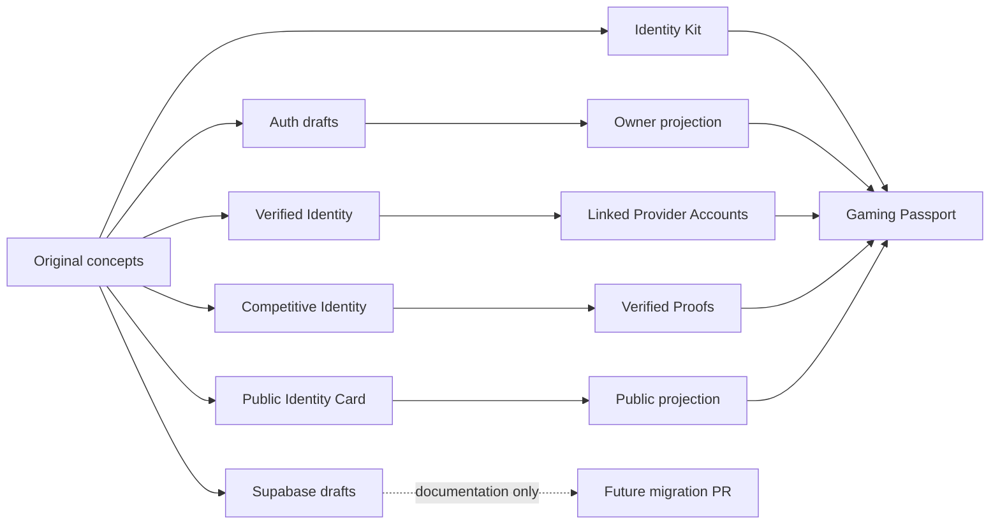

# Gaming Passport Migration Map

This map was created from a read-only inventory of the original worktree at `C:\Users\Juandi Gamer\Documents\TryhardNames`. That workspace was not modified. Its modules and documents are references only, not approved implementation decisions.

## Inventory Summary

Read-only references inspected:

- Identity Kit model and artifact tokens;
- public identity snapshot and slug helpers;
- competitive identity presence and Riot utilities;
- verified identity constants, state model, visibility policy, and metadata redaction;
- auth and provider linking file layout;
- Discord provider linking references;
- Riot sync and API normalization references;
- profile intelligence and identity memory docs;
- architecture and consolidation docs;
- Supabase draft SQL files.

## Concept Map

| Existing concept | Gaming Passport mapping | Decision |
| --- | --- | --- |
| Identity Kit | Passport editor and builder | Preserve and rename conceptually. Do not change UI in PR2. |
| Public Identity Card | Public projection artifact inside Passport | Merge into Gaming Passport. Do not keep as a separate product. |
| Public Gamer Identity `/id/:slug` draft | Future Public Gaming Passport route | Preserve route target in docs only. Do not implement route. |
| Competitive Identity | Proof subsystem for competitive facts | Merge into `VerifiedProof` taxonomy. |
| Verified Identity | Provider/proof verification subsystem | Merge into Linked Provider and Verified Proof contracts. |
| Verified sidecar | Temporary local cache pattern | Do not copy. Replace with future server-side linked provider rows and token storage. |
| Linked provider account | `linked_provider_accounts` | Preserve concept, tighten statuses and global ownership uniqueness. |
| Discord linked identity | `social_verification` and Linked Provider Account | Preserve as social verification. Not a competitive proof. |
| Riot linked identity | `provider_ownership` and `RiotProvider` | Preserve ownership. Riot alone does not create rank proof. |
| League of Legends presence | `LeagueOfLegendsAdapter` proofs under `RiotProvider` | Rename from generic presence slot to `competitive_rank` proof. |
| Valorant references | None for PR2 | Discard from PR2 scope. |
| Tryhard Score | None for PR2 | Discard for this foundation. Do not create global score. |
| Public publish prefs | `passport_visibility_settings` and publishability policy | Preserve as private settings. Derive `publishable`. |
| `gamer_profiles` row | Future owner and passport persistence | Rename conceptually to `gaming_passports` plus owner projection. No SQL. |
| `verified_competitive_presence` JSON | `verified_proofs` rows | Replace with normalized proof collection. |
| Identity Memory | Private personalization input | Postpone. It may inform private recommendations, not public proof. |
| Profile Intelligence | Private recommendation system | Postpone. Keep out of public projection. |
| PocketBase name leaderboards | Acquisition/legacy generator data | Keep isolated from Passport. |
| Supabase draft SQL | Future migration reference | Do not execute or copy SQL into PR2. |

## What Is Conserved

- Identity Kit as the owner-facing builder/editor.
- Slug validation as a future route requirement.
- Explicit state machines for verification lifecycle.
- Public projection by allowlist.
- Metadata private by default, with future explicit public schemas per adapter.
- Provider ownership separated from competitive proof.
- Public copy that avoids tracker and leaderboard framing.

## What Is Renamed

- "Owned Gamer Profile" -> Gaming Passport owner projection.
- "Public Identity Card" -> Public Gaming Passport scene/projection.
- "Verified competitive presence slot" -> Verified Proof.
- "Riot presence" -> LeagueOfLegendsAdapter normalized proof when the game data is actually synced.
- "Limited public card" -> publication consent and public projection settings.

## What Is Fused

- Public Identity Card, Competitive Identity, and Verified Identity merge into the Gaming Passport domain.
- Provider account state and proof state become separate finite-state contracts.
- Public rendering becomes a single scene, not separate public products.

## What Is Discarded

- Tryhard Score for PR2.
- Valorant from PR2.
- Manual labels as verified proof.
- Future provider placeholders in code.
- Epic, Roblox, Free Fire, Steam, FACEIT, and other out-of-scope provider contracts.
- Supabase service role, env, RPC, and migration changes.
- Any route or UI implementation from the original workspace.

## What Is Postponed

- Auth implementation.
- Supabase schema migrations.
- Discord implementation.
- Riot implementation.
- League of Legends API sync.
- Public `/id/:slug` route activation.
- Search indexing.
- Profile discovery.
- Server token storage.
- Identity Memory public use.
- Profile Intelligence public use.
- Cosmetic unlock computation.

## Reusable Code Signals

Potentially reusable later:

- slug normalization and reserved-route checks from `public-identity/publicSlug.js`;
- finite transition approach from `verified-identity/verification/stateModel.js`;
- metadata redaction pattern from `verified-identity/utils/redactMetadata.js` for logs only, not for public DTO allowlisting;
- public snapshot allowlist idea from `public-identity/buildHostedPublicIdentitySnapshot.js`;
- bounded competitive redaction from `competitive-identity/verifiedCompetitivePresence.js`.

Not copied in PR2:

- localStorage loaders;
- Supabase browser client;
- Supabase admin API;
- Discord OAuth code;
- Riot API client;
- route registrations;
- React account panels;
- public pages;
- Valorant sync normalization;
- Tryhard Score docs or assumptions.

## Why Code Was Not Copied

The original workspace mixes useful concepts with runtime integration, Supabase assumptions, route changes, local caches, provider-specific implementations, and out-of-scope games. PR2 needs a stable conceptual and contractual foundation, not a transplant of unapproved advanced work.

The new domain module therefore reimplements only pure, side-effect-free policies:

- constants;
- contracts;
- state transitions;
- owner publication command policy;
- anonymous public serving policy;
- safe public projection.

## Review Corrections Applied

PR2 now separates owner publishability from anonymous public serving:

- Owner publishability may depend on authenticated Parent Auth.
- Public serving never receives Parent Auth and uses only persisted public state.

Public DTOs are intentionally minimal:

- no Passport ids;
- no owner ids;
- no linked provider account ids;
- no proof ids;
- no external account ids;
- no `sourceKey`;
- no `normalizedValue`;
- no `verificationMethod`;
- no `normalizerVersion`;
- no generic `metadataSafe`.

`metadataSafe` remains internal by default. Future GameAdapters must define explicit public attribute schemas before any metadata is exposed.

Provider visibility is explicit on linked provider accounts. Public projection includes only verified providers with `visibility: public`; private verified providers may still support internal ownership policy. Whether hidden verified providers should be sufficient for publication remains a pending product decision.

External account ids are opaque. ProviderAdapters must canonicalize them according to official provider rules before persistence; the shared domain does not lowercase them generically.

Persisted slugs must be canonical. Normalization is for future form input, not for silently accepting non-canonical stored slugs.

Verified proofs now have structural invariants by proof type. Social and ownership proofs are provider-sourced and have no game. Competitive, rating, progression, and title/completion proofs are game-adapter-sourced and require a game.

## Migration Direction

## PR2 Guardrails

This PR must not:

- copy the original workspace in bulk;
- modify the original workspace;
- switch the original workspace branch;
- implement Supabase;
- create tables;
- execute SQL;
- implement providers;
- modify visible UI;
- add routes;
- change SEO behavior;
- change generators.
