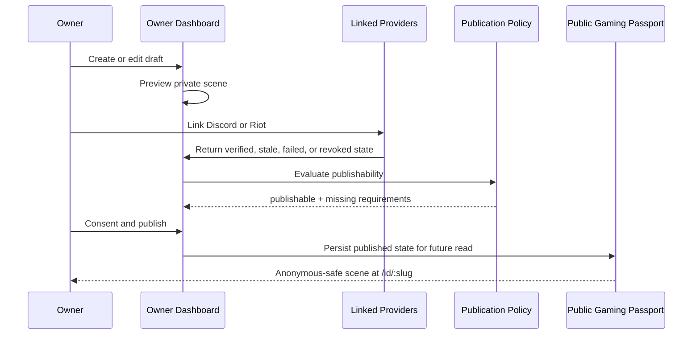

# Gaming Passport UI Contract

This document defines target surfaces only. It does not implement routes, React components, visible UI changes, Supabase reads, auth, Discord, Riot, or profile publishing.

## Current Implementation Note

This document began as a target UI contract. Since PR4 and PR6, `/account` and `/gaming-passport` have been implemented. `/account` is currently a protected Parent Auth private-draft surface, and `/gaming-passport` is a public review landing page. PR15 implements `/id/:slug` as an MVP public projection route; the public profile contract below applies to that route.

Riot OAuth, Discord OAuth, linked provider management, and provider proof sync are still not implemented. Publishing commands, MVP public profile serving, and Passport Cosmetics Foundation are implemented, but provider runtime remains pending.

## Surfaces

Two surfaces exist:

1. Owner Dashboard
2. Public Gaming Passport

Identity Kit remains the existing editor during migration. It should become the builder/editor surface for Gaming Passport, not a parallel product.

## Owner Dashboard

Current route:

- `/account`

Owner Dashboard responsibilities:

- draft creation and editing;
- private preview;
- provider connection management;
- synchronization status;
- privacy settings;
- publication settings;
- cosmetic selection;
- recommendations for linking accounts;
- publishability explanation.

Owner publishability is a command policy. It may check Parent Auth because only the owner can publish or republish.

Owner Dashboard may show:

- Parent Auth account context;
- verified provider status;
- pending, failed, stale, or revoked provider states;
- proof sync errors;
- unpublished draft fields;
- private recommendations;
- "connect account" guidance.

Owner Dashboard must not claim that unverified data is verified. It must not show manual claims as `VerifiedProof`.

## Public Gaming Passport

Implemented MVP route:

- `/id/:slug`

Public Gaming Passport responsibilities:

- one visual scene;
- alias and avatar;
- existing verifications only;
- 4 to 6 featured proofs, capped at 6;
- equipped cosmetics;
- last updated timestamp;
- share affordance;
- safe public projection only.

Public serving is a read policy for anonymous visitors. It must not require Parent Auth once the Passport is already `published`.

Public Gaming Passport must not show:

- empty proof slots;
- "Connect account" cards;
- placeholders;
- match history;
- tracker-style tables;
- Parent Auth provider;
- email;
- private owner metadata;
- raw provider payloads;
- provider tokens;
- dashboard recommendations.

It also must not expose Passport ids, linked provider account ids, proof ids, owner ids, external account ids, source keys, normalized values, verification methods, normalizer versions, or generic metadata fields.

## Future Landing

Current route:

- `/gaming-passport`

This is the current public product landing surface. It must not block current generators or require an account for generator use.

## Identity Kit Migration Route

Existing route:

- `/identity-kit`

During migration, Identity Kit remains the editor entry point. It can eventually become the builder view for a Gaming Passport draft. This PR does not modify the route or UI.

## Private/Public Flow

## Public DTO Contract

The public Passport DTO contains exactly:

- `slug`;
- `alias`;
- `avatarUrl`;
- `publishedAt`;
- `updatedAt`;
- `scene`;
- `linkedProviders`;
- `featuredProofs`.

The linked provider DTO contains exactly:

- `provider`;
- `displayName`;
- `verifiedAt`;
- `lastSyncedAt`.

The proof DTO contains exactly:

- `provider`;
- `game`;
- `proofType`;
- `mode`;
- `title`;
- `displayValue`;
- `season`;
- `status`;
- `verifiedAt`;
- `lastSyncedAt`;
- `staleAt`.

Provider visibility controls only whether a provider summary appears in `linkedProviders`. A private verified provider may still be used internally by policy while being omitted from public provider display; final product policy on hidden providers and publication remains pending.

## Visual Contract

The public scene should feel like a gamer resume, not an analytics dashboard.

Required hierarchy:

1. Alias/avatar identity.
2. Verified ownership and social legitimacy.
3. Featured proofs.
4. Equipped cosmetics.
5. Last updated and share actions.

Proof presentation rules:

- rank proofs use compact title/value labels;
- stale proofs must be visibly stale if displayed;
- revoked proofs never display;
- no proof uses third-party raw payload JSON;
- no proof uses private notes;
- no proof renders if its source provider account is invalid.
- no generic metadata field renders publicly until a future GameAdapter defines an explicit public attribute schema.

Cosmetic rules:

- cosmetics frame the Passport;
- cosmetics do not imply rank;
- cosmetics do not monetize third-party assets;
- cosmetics do not invent achievements.

PR21 adds the private Passport Cosmetics panel and safe public cosmetic rendering. The UI may render TryhardNames-owned visual cosmetics from `themeId` and `equippedCosmeticIds`, but it must not render inventory, prices, purchase history, locked entitlements, fake proof badges, fake rank frames, Riot assets, or provider-private data.

The future cosmetics showcase route is `/cosmetics`, not `/store`, and it is not implemented in PR21.

## Route Contract

Documented target routes:

- `/gaming-passport` -> implemented public landing;
- `/account` -> implemented protected private draft dashboard;
- `/id/:slug` -> implemented MVP public Passport projection;
- `/identity-kit` -> existing editor during migration.

The original contract PR did not implement or register these routes. Current implementation status is tracked in `docs/product/CURRENT_STATE_AND_ROADMAP.md`.

## Empty State Contract

Private dashboard empty states may guide the owner to link accounts.

Public Passport empty states do not exist. If a public section has no data, it is omitted.

## Accessibility And Safety Contract

Future UI should:

- expose timestamps as readable text;
- distinguish current, stale, and revoked states;
- avoid color-only proof status communication;
- avoid comparison language;
- avoid "best", "better than", "top player", or leaderboard copy unless backed by official provider data and product approval.
