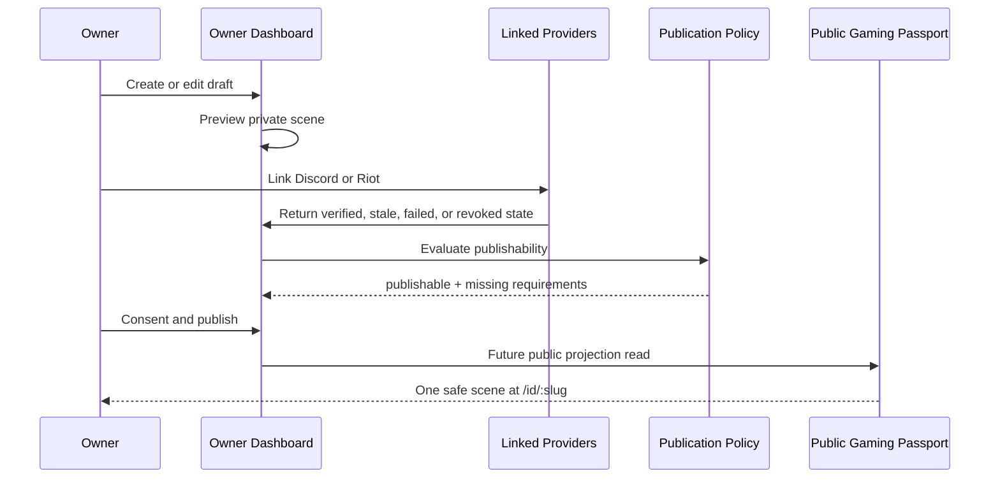

# Gaming Passport UI Contract

This document defines target surfaces only. It does not implement routes, React components, visible UI changes, Supabase reads, auth, Discord, Riot, or profile publishing.

## Surfaces

Two surfaces exist:

1. Owner Dashboard
2. Public Gaming Passport

Identity Kit remains the existing editor during migration. It should become the builder/editor surface for Gaming Passport, not a parallel product.

## Owner Dashboard

Target route, not implemented in this PR:

- `/account`

Owner Dashboard responsibilities:

- draft creation and editing;
- private preview;
- provider connection management;
- synchronization status;
- privacy settings;
- publication settings;
- cosmetic selection;
- recommendations for linking accounts;
- publishability explanation.

Owner Dashboard may show:

- Parent Auth account context;
- verified provider status;
- pending, failed, stale, or revoked provider states;
- proof sync errors;
- unpublished draft fields;
- private recommendations;
- "connect account" guidance.

Owner Dashboard must not claim that unverified data is verified. It must not show manual claims as `VerifiedProof`.

## Public Gaming Passport

Target route, not implemented in this PR:

- `/id/:slug`

Public Gaming Passport responsibilities:

- one visual scene;
- alias and avatar;
- existing verifications only;
- 4 to 6 featured proofs, capped at 6;
- equipped cosmetics;
- last updated timestamp;
- share affordance;
- safe public projection only.

Public Gaming Passport must not show:

- empty proof slots;
- "Connect account" cards;
- placeholders;
- match history;
- tracker-style tables;
- Parent Auth provider;
- email;
- private owner metadata;
- raw provider payloads;
- provider tokens;
- dashboard recommendations.

## Future Landing

Target route, not implemented in this PR:

- `/gaming-passport`

This is a future product landing surface. It must not block current generators or require an account for generator use.

## Identity Kit Migration Route

Existing route:

- `/identity-kit`

During migration, Identity Kit remains the editor entry point. It can eventually become the builder view for a Gaming Passport draft. This PR does not modify the route or UI.

## Private/Public Flow

## Visual Contract

The public scene should feel like a gamer resume, not an analytics dashboard.

Required hierarchy:

1. Alias/avatar identity.
2. Verified ownership and social legitimacy.
3. Featured proofs.
4. Equipped cosmetics.
5. Last updated and share actions.

Proof presentation rules:

- rank proofs use compact title/value labels;
- stale proofs must be visibly stale if displayed;
- revoked proofs never display;
- no proof uses third-party raw payload JSON;
- no proof uses private notes;
- no proof renders if its source provider account is invalid.

Cosmetic rules:

- cosmetics frame the Passport;
- cosmetics do not imply rank;
- cosmetics do not monetize third-party assets;
- cosmetics do not invent achievements.

## Route Contract

Documented target routes:

- `/gaming-passport` -> future landing;
- `/account` -> dashboard;
- `/id/:slug` -> public Passport;
- `/identity-kit` -> existing editor during migration.

This PR must not implement or register these routes.

## Empty State Contract

Private dashboard empty states may guide the owner to link accounts.

Public Passport empty states do not exist. If a public section has no data, it is omitted.

## Accessibility And Safety Contract

Future UI should:

- expose timestamps as readable text;
- distinguish current, stale, and revoked states;
- avoid color-only proof status communication;
- avoid comparison language;
- avoid "best", "better than", "top player", or leaderboard copy unless backed by official provider data and product approval.
